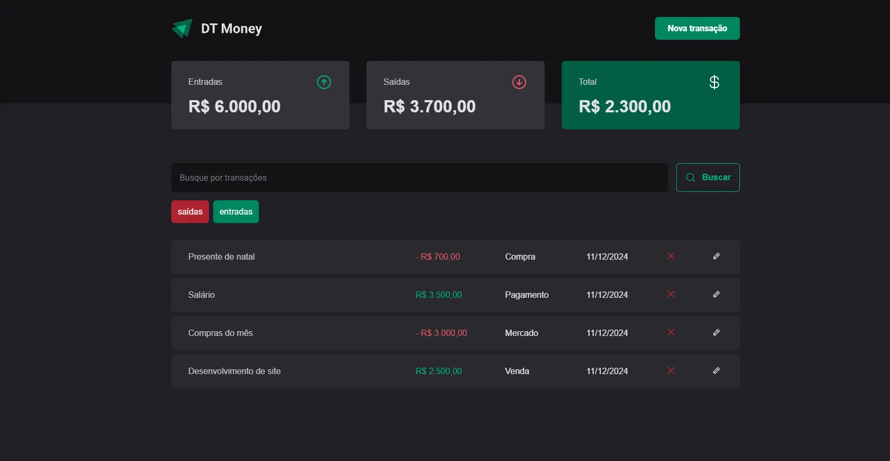

<h1 align="center"> DT Money </h1>



DT Money é uma aplicação web que te auxilia no balanço financeiro. [Rocketseat](https://www.rocketseat.com.br/).

## Tópicos
  - [Pré-requisitos](#pré-requisitos)
  - [Instalação](#instruções-de-instalação)
  - [backend](#backend-da-aplicação)
  - [Tecnologias utilizadas](#tecnologias-utilizadas)
  - [Deploy](#deploy)
  - [Licença](#licença)
## Pré-requisitos
Você precisa ter [Node.js](https://nodejs.org) instalado na sua máquina para rodar esta aplicação.

## Instruções de instalação

1. **Clonando o projeto**
```bash
git clone https://github.com/alanwengrze/ignite_dt-money.git
```
2. **Navegando até o projeto**

```bash
cd ignite_dt-money
```
3. **Instalando as dependências**
```bash
npm install
ou
npm i
```
4. **Rodando a aplicação na máquina local**
```bash
npm run dev
```


## Backend da aplicação
Para ter uma experiência completa, é necessário utilizar o backend da aplicação. Você pode acessar o [**backend clicando aqui**](https://github.com/alanwengrze/dt-money-api).

## Tecnologias utilizadas
- [**axios**](https://axios-http.com/)
- [**react**](https://reactjs.org/)
- [**phosphor-react**](https://phosphoricons.com/)
- [**styled-components**](https://styled-components.com/)
- [**zod**](https://zod.dev/)
- [**react-hook-form**](https://react-hook-form.com/)
- [**radix-ui**](https://www.radix-ui.com/)

## Deploy
[Vercel](https://vercel.com/)
Acesse ao deploy do [DT Money](https://ignite-dt-money-nu.vercel.app/)

## Licença

O app **DT Money** é distribuída sob a licença MIT. Isso significa que você pode usar, modificar e distribuir o código desta API livremente, desde que inclua a declaração de direitos autorais e a licença MIT em qualquer cópia ou parte dela.
